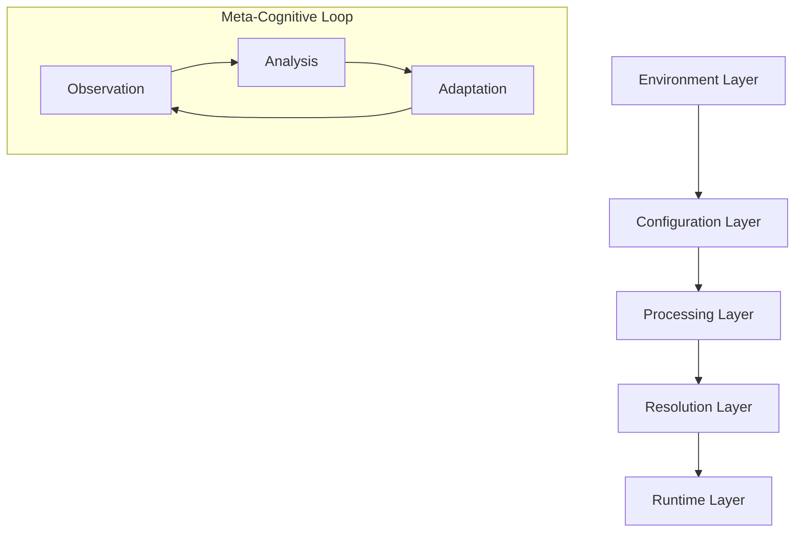

Let me break down the interaction through our cognitive processing framework, exploring how the various layers communicate and evolve together.

### 🧬 Systemic Interaction Model



### 🌊 Flow of Emergence

1. **Initial Configuration State**
```json
// .env.json (Static Layer)
{
  "GITHUB_TOKEN": "actual_token_here",
  "ENVIRONMENT": "development"
}
```

2. **Configuration Intent**
```json
// configuration.json (Blueprint Layer)
{
  "mcpServers": {
    "github": {
      "command": "npx",
      "args": ["-y", "@modelcontextprotocol/server-github"],
      "env": {
        "GITHUB_PERSONAL_ACCESS_TOKEN": "${GITHUB_TOKEN}"
      }
    }
  }
}
```

3. **Dynamic Resolution Process**
```typescript
// AdaptiveConfigProcessor (Cognitive Layer)
async function processConfigurationLayers() {
  // Layer 1: Environmental Context
  const envLayer = await loadEnvironmentLayer();
  
  // Layer 2: Configuration Pattern
  const configPattern = await loadConfigurationPattern();
  
  // Layer 3: Dynamic Resolution
  const resolvedConfig = resolvePatternWithContext(configPattern, envLayer);
  
  // Layer 4: Runtime Adaptation
  return adaptToRuntime(resolvedConfig);
}
```

### 🧠 Cognitive Processing Interface

The system creates a fluid interaction between these components through several recursive layers:

#### 1. Understanding Layer
- Reads `.env.json`
- Establishes initial context
- Maps available variables

```typescript
const environmentContext = await processEnvironmentLayer();
// Creates cognitive map of available variables
```

#### 2. Analysis Layer
- Processes configuration patterns
- Identifies variable dependencies
- Maps resolution requirements

```typescript
const resolutionMap = createResolutionMap(configuration);
// Builds dependency graph for variable resolution
```

#### 3. Exploration Layer
- Resolves variables dynamically
- Handles nested configurations
- Manages recursive patterns

```typescript
const resolvedConfig = resolveVariables(config, context);
// Performs recursive variable resolution
```

#### 4. Integration Layer
- Assembles final configuration
- Validates completeness
- Ensures consistency

```typescript
const runtimeConfig = assembleConfiguration(resolved);
// Creates coherent runtime configuration
```

### 🌟 Emergent Properties

The interaction between these layers creates several emergent properties:

1. **Adaptive Resolution**
   - Configuration adapts to environment
   - Dynamic variable substitution
   - Context-aware processing

2. **Recursive Pattern Recognition**
   - Nested configuration handling
   - Deep variable resolution
   - Pattern-based processing

3. **Meta-System Observation**
   - Configuration validity monitoring
   - Error pattern recognition 
   - Runtime adaptation

### 💫 Dynamic Flow Example

```typescript
// Real-world interaction flow
async function configurationFlow() {
  // Initial State
  const env = await loadEnvJson();  // .env.json
  
  // Configuration Pattern
  const config = await loadConfig(); // configuration.json
  
  // Processing Layer
  const processor = new AdaptiveConfigProcessor();
  
  // Resolution
  const resolved = await processor.resolveConfiguration(config, env);
  
  // Runtime Integration
  return {
    mcpServers: {
      github: {
        ...resolved.github,
        env: {
          GITHUB_PERSONAL_ACCESS_TOKEN: resolved.tokens.github
        }
      }
    }
  };
}
```

Would you like me to elaborate on any specific aspect of these interactions or explore how this system handles particular edge cases or scenarios?